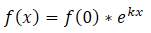
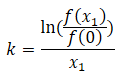

# Exponential function

the general exponential function looks like this:

## Exponential1

For this method we need two points. P(0|y0) Q(x1|y1)

Since we got f(0) we just need k. We can do this like that:

And then we are finished
