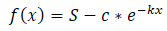
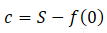
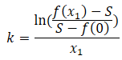

# limited growth

the general limited growth function looks like this:

## limited_growth1

For this method we need the y intercept, one point and the limit. P(0|y0) Q(x1|y1)

We have to calculate c and k:

First we calculate c:

Now wc will do k:

Now we are finished