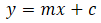
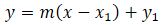
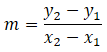
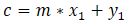

# Linear function

the general linear function looks like this:



## Linear1

We can move the function by adding this:



At first we will get the pitch. We can do this with two given points on the function.



Now we can calculate ```c```:


