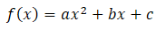
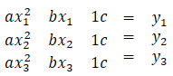

# 2nd degree function

the general function looks like this:

To get this we need 3 Points. 

So we enter this: P1(x1|y1) P2(x2y2) P3(x3|y3)

We have to calculate a, b and c:

to do this we will use a linear matrix equation, or system of linear scalar equations.

Now we got somethin that looks like this:

Now we can use the gaussian elimination.

So we have to leave out a, b and c.

Now it uses the numpy algorithm to solve this.

This will get an array with 3 entries.

The first entry will be "a" the second "b" and the third one "c".

Now we will approve it with another numpy function because the output could be a little inaccurate.

Then it will print the calculated solution, and a warning if the solution is inaccurate.

## new dependency: numpy
